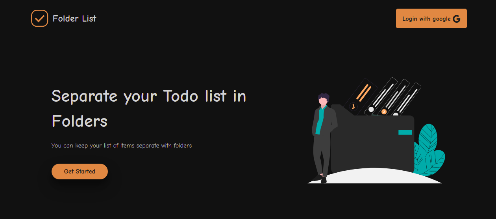

<h2>Client setup</h2>

```
cd client

npm install
```

<br>

Now you are done with you setup and can start your client and server at once

```
npm run dev
```

<br>

<h3>Now it should open homepage of this folder list app on your default browser</h3>

<div align="center">
  
</div>
